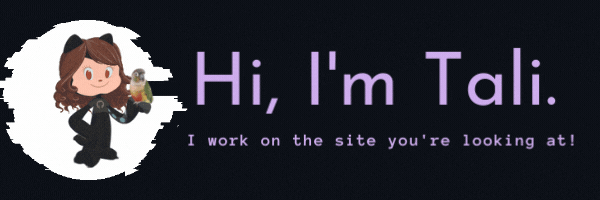

    

 

    

<h3 align="center">Connect with me:</h3>
    

        
        &nbsp&nbsp&nbsp
        
        &nbsp&nbsp&nbsp
        
        &nbsp&nbsp&nbsp
        <a href="https://taliherzka.com">" height="40" /></a>
    

     
    <h3 align="center">Connect with my parrot 🦜 </h3>
        

            
        

